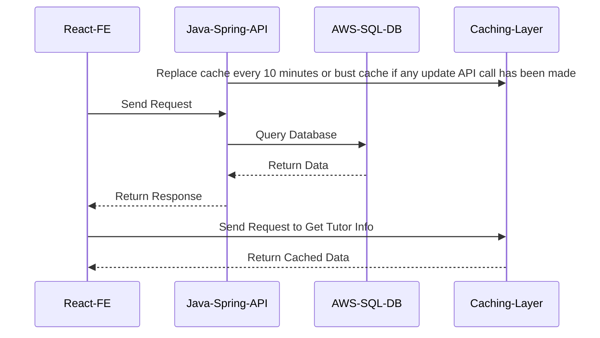

# How To Run
You can use the deployed link: https://online-tutoring-team-eleven.vercel.app/ to view our website. Should you want to run it locally, follow these steps:

- Clone this GitHub Repo into your work environment by using: `git clone https://github.com/Online-Tutoring-Application-Team-11/FE-tutoring-website.git`
- Navigate to the FE folder by `cd .\FE-tutoring-website\` and then `cd .\FE\`
- Run `npm install` to install all necessary modules
- Run `npm start` to start the website on your localhost

# FE-tutoring-website
The Frontend code for Online Tutoring Application Team 11.

